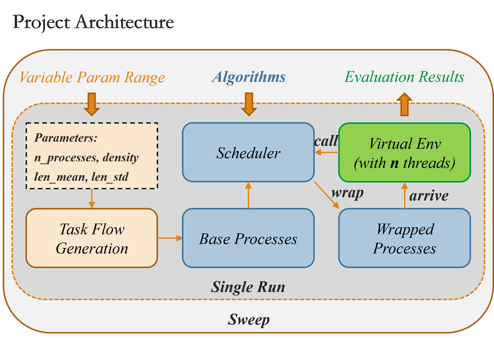

  

# *Process Scheduler Bench*  
> Benchmark a variety of process scheduling algorithms with visualization!  
> **Note:** This is a simulation primarily designed for educational purposes.  

## 🔮 *Get Started*  
- Clone this repository using:  
  ```bash  
  git clone github.com/kkaiwwana/PSchedulerBench.git  
  ```  
- The configuration file can be found in `./config/`, where you can customize algorithm parameters and experiment setups. However, you can directly start a benchmark **sweep** with:  
  ```bash  
  python scripts/evaluate.py  
  ```  
- This will automatically create a log folder in `./log/TIME_THAT_EXP_STARTED/`. Here, you will find the following:  
  - Figures generated from the benchmark  
  - Additional information (more features may be added in the future)  
- Since the **sweep** process is somewhat complex, it will be explained in the next section.  

---  

  

---  

## 🎶 *More Details*  

### Algorithms  
- This project includes implementations of several (technically, 10) scheduling algorithms. Examples include simple ones like:  
  - **FCFS (First-Come, First-Served)**  
  - **SJF (Shortest Job First)**  
  And more complex ones like:  
  - **MFQ (Multilevel Feedback Queue)**  
- Due to limitations in the initial code architecture, the ready-to-run processes are stored in an `OrderedDict`, which effectively acts as a queue. As a result, all algorithm implementations are based on this structure. Unfortunately, this compromises some performance.  

### Metrics  
- Several evaluation metrics are implemented to assess the algorithms’ performance. Specifically, there are two main metrics:  
  1. **Turnaround Time (TAT):**  
     $$\text{Turnaround Time (TAT)} = \text{Completion Time} - \text{Arrival Time}$$  
  2. **Response Time (RT):**  
     $$\text{Response Time (RT)} = \text{First Response Time} - \text{Arrival Time}$$  
  - Both metrics include three variations:  
    - Normalized (weighted relative to process length)  
    - Priority-weighted  
    - Priority-weighted and normalized  
  - For example:  
    $$\text{Priority-weighted TAT} = \frac{\text{Priority}_i \times \text{TAT}_i}{\sum \text{Priority}_i}$$  
    $$\text{Priority-weighted RT} = \frac{\text{Priority}_i \times \text{RT}_i}{\sum \text{Priority}_i}$$  
- Additionally, scheduling times are recorded, as they incur a cost in real systems and should be accounted for.  

### Process Flow Generation  
- In real-world scenarios, process arrivals are often modeled using a **Poisson distribution**: $$\pi(\lambda)$$.  
- To generate $n$ processes with an average length $t$:  
  1. Assign processes to a time range proportional to $n \times t$.  
  2. Introduce the concept of **process density**, defined as the total required computing time divided by the time range.  
  3. Given the number of processes $n$, density $d$, and their average length $t$: $$\bar{t} = \frac{n \cdot t}{d}$$  
     The number of processes arriving at timestep $T$ follows: $$T \sim \pi\left(\frac{n}{\bar{t}}\right)$$  

### Sweep and Evaluation  
- To fairly compare algorithms under different variables (e.g., total number of processes, process density), other parameters must remain fixed.  
- During a sweep, if there are four parameters $A, B, C, D$ with $a, b, c, d$ possible values, the process works as follows:  
  - Fix $b \times c \times d$ parameter combinations.  
  - Benchmark different schedulers under these setups, varying only parameter $a$.  
- This ensures a systematic and fair evaluation of the algorithms.  

---  

