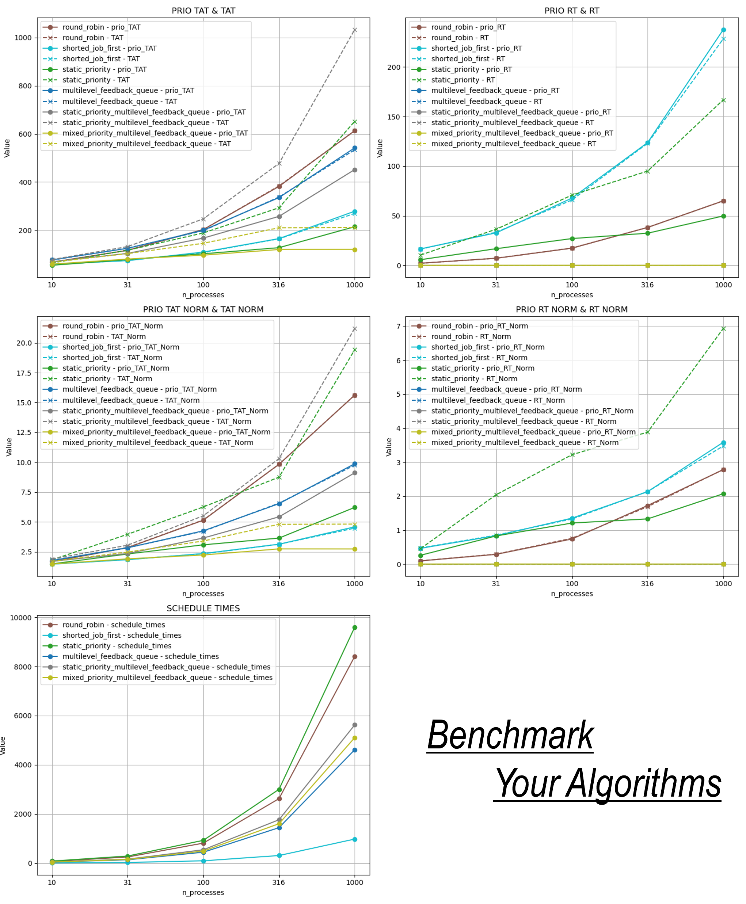

---------

# *Process Scheduler Bench*
> Benchmark (bunch of) process scheduling algorithms with visualization! Note: it's  simulated and mostly for educational
> purpose.

## 🔮 *Get started.*
- Clone this repo with `git clone github.com/kkaiwwana/PSchedulerBench.git`.
- The config file can be found in `./config/`, and you can customize algorithm params, experiment setups. But anyway, 
you can always start a benchmark **sweep** with `python scripts/evaluate.py`.
- This will automatically create log folder in `./log/TIME_THAT_EXP_STARTED/`. And you can find following figures and maybe
more info in the future.
- It's kind complicated to describe how **sweep** process work, I'll put this in next section.

------

______
## 🎶 *More Details.*
### Algorithms
- This project has already implemented several (technically, 10) scheduling algorithms, for example, 
algorithms as simple as **FCFS (First-Come, First-Served)**, **SJF(Shorted Job First)**, or more complex ones like
**MFQ (Multilevel Feedback Queue)** etc. 
- However, due to limitations of initial code architecture design, the processes
ready to run are put in a OrderedDict, which can be considered as a Queue. So all algrithom implementation are based on
that. Sadly, this sacrifices some performance (But this python, who cares?).

### Metrics

- I also implemented several evaluation metrics to track algorithm's performance. Specifically, there are two main metrics.
Firstly, **TAT (Turnaround Time)** based metrics and secondly, **Response Time** based ones. There all have 3 extra variations:
normalized (weighted) one (w.r.t process length), priority-weighted ones and priority-weighted normalized one. Formally,
they are as follows:

### Sweep and evaluation

